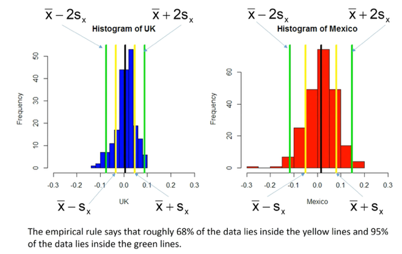
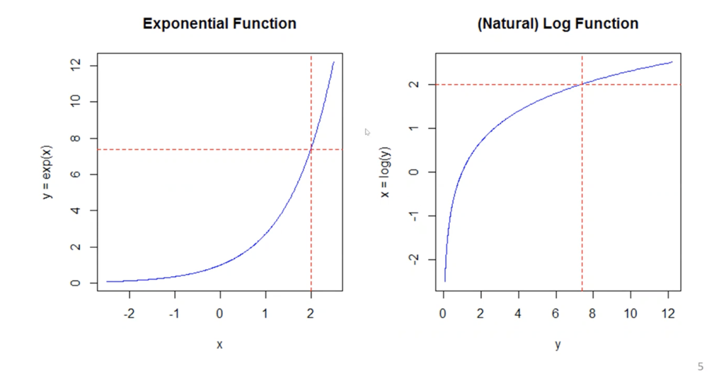

# Pre-MBA Statistics

<em>Pre-MBA Statistics</em>

<h1>Central tendency - mean, median</h1>

<strong>Median</strong> is less sensitive to <strong>outliers</strong> than the <strong>mean </strong>( $\bar{x}$). Median nicer to report when extreme outliers. If median and mean are very different, it is because of outliers. 

The <strong>p</strong><strong>th</strong><strong> quantile</strong> is the number such that p% of observations are below, (1-p)% above

<h1>Sample spread - variance, standard deviation</h1>

The average of the difference from each variable observation to the mean is always 0. The size of individual differences between variable and mean tells how much spread the sample is.

Sample variance $S_x^2$ measures spread, is the average squared distance of the mean:

$$
S_x^2 = \frac{1}{n-1}\sum_{i=1}^{n}(x_i-\bar{x})^2
$$
<ul><li>
Note we square $x_i-\bar{x}$ to ensure the number will be positive. The larger the value, the more spread. 
</li><li>
If $n$ is large, dividing by $\frac{1}{n}$ or $\frac{1}{n-1}$ does not change much. 
</li><li>
Lowest $S_x^2$ is 0 (all numbers coincide with the mean). 
</li></ul>

Units are in units of x squared, solved by taking the square root of the sample variance, and get the sample standard deviation $S_x$:

$$
S_x = \sqrt{S_x^2} = \sqrt{\frac{1}{n-1}\sum_{i=1}^{n}(x_i-\bar{x})^2}
$$

The standard deviation is a measure of the sample spread measured in units of $x$. 

<h1>Empirical rule</h1>

The empirical rule will help us understand $S_x$ and relate the summaries back to the histogram. 

For <strong>Mound-shape data </strong>(bell shape, tails on both sides), the empirical rule claims that

<ul><li>
68% of data is within  $(\bar{x}-S_x,\bar{x}+S_x) = \bar{x} \pm S_x$
</li><li>
95% of data within  $(\bar{x}-2S_x,\bar{x}+2S_x) = \bar{x} \pm 2S_x$
</li></ul>

<strong>Comparing mutual funds</strong> – comparing mean vs standard deviation: Select those with higher mean returns and lowest standard deviation (variability). Can be seen from scatterplot. 

<h1>Variable association – Conditional statistics</h1>

Relation between categorical variables to unlock relations. For instance, pivot table and fraction of observations in each bucket (% of total, % of pivot row, % of pivot column). 

Conditioning relates to a forecasting question where you are given a piece of information. If I condition on whether people watch the Simpsons, I am asking “if I tell you whether a person watches the Simpsons, how does that affect your view on whether that person drinks soda. If I condition on Soda, I am asking “if I tell you whether a person drinks Soda or not, how does that affect your view on whether that person watches the Simpsons.

<h1>Covariance and correlation – scatterplots &amp; linear relation</h1>

Covariance and correlation summarize how strong a linear relationship is between two variables. 

<strong>Sample covariance</strong> $S_{xy}$ between x and y is:

$$
S_{xy} = \frac{1}{n-1}\sum_{i=1}^{n}(x_i-\bar{x})(y_i-\bar{y})
$$

Sample covariance $r_{xy}$ units are units of x times units of y. Hence, we use sample <strong>correlation</strong> (unit-free measure), which is the sample covariance over the product of standard deviations of x and y:

$$
r_{xy} = \frac{S_{xy}}{S_x S_y}
$$

Sample correlation lies between -1 and 1 ($-1 \le r_{xy} < 1$), giving both <strong>linear relation</strong> strength and <strong>direction</strong>. The closer to 1, the stronger linear correlation (positive, or negative slope). Correlation does not give us the measure of the slope, just the linear relationship strength.

Samples can have perfect non-linear relationships, and give correlation of 0, since correlation only measures linear relationship. Low correlation might mean either low association between the data, or follow a non-linear relation (e.g., parabolic, logarithmic, etc.). 

If a sample follows a parabolic curve relationship, correlation between x and y would be 0, but correlation between x2 and y2 would be 1.

Building a correlation matrix (symmetric matrix) is helpful to compare many variables.  

Focus on the sign of the covariance / correlation, it tells us which quadrant of the scatterplot we should expect to see our data respect to the mean. Positive covariance means that when one variable is above its mean, the other should be too. If negative, when one variable is above the mean, the other should be below. 

Correlation has always same sign as covariance, as we are dividing by two positive numbers (standard deviation). 

<h1>Natural logarithms – transforming positive, right-skewed data</h1>

It is common to transform right-skewed data to look mound-shaped/bell-shaped (where empirical rule is applicable). 

The natural logarithm is the inverse of the exponential function $e$: $e^2 = 7.389 \to \ln(7.389) = 2$

Properties:

$$
e^{ab} = e^ae^b \to \ln(ab) = \ln(a)+\ln(b)
$$
$$
\ln(a^b) = b \ln(a)
$$

Logs are only defined for positive numbers. 

We can log-transform distributions so that they passed from skewed to mount-shaped, apply the empirical rule, and we can come back to the original data by taking the exponent. Same for the empirical rule boundaries, can be taken the exponent to relate to the original data and make it more interpretable. 

